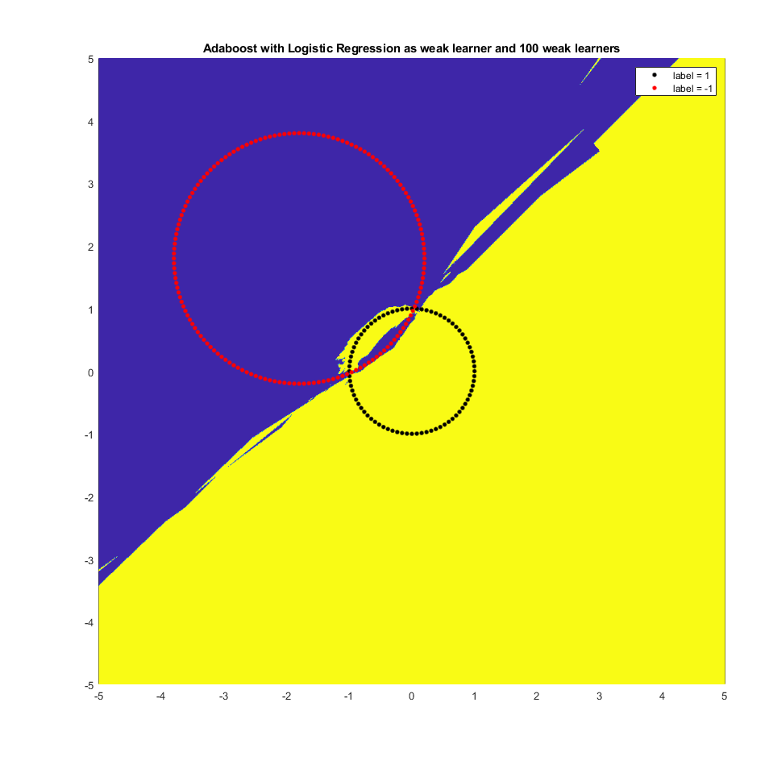
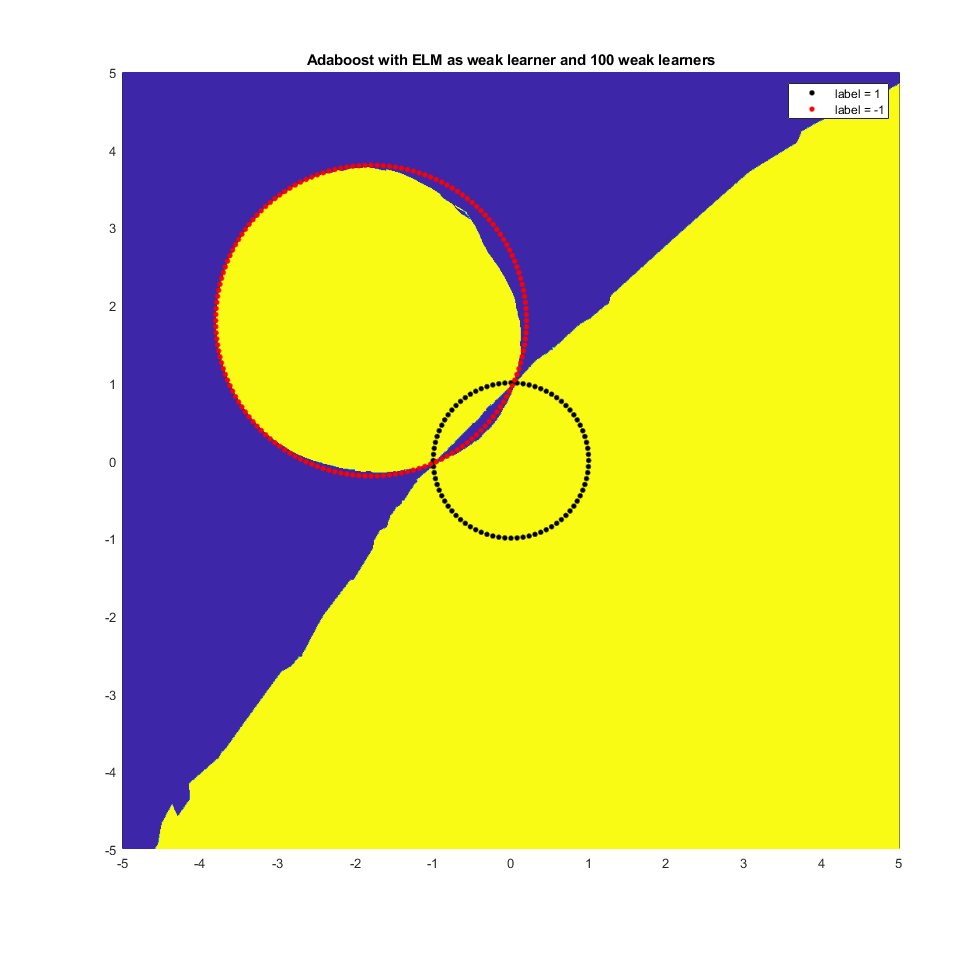
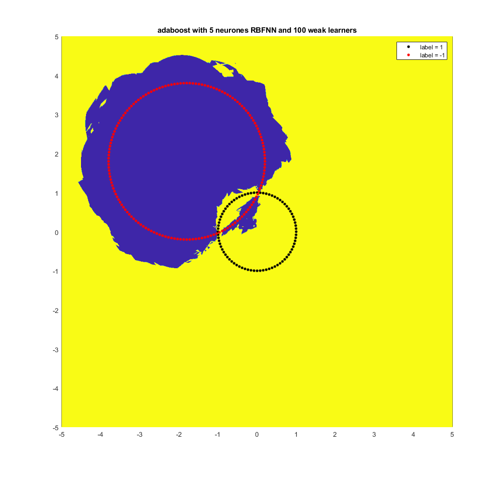
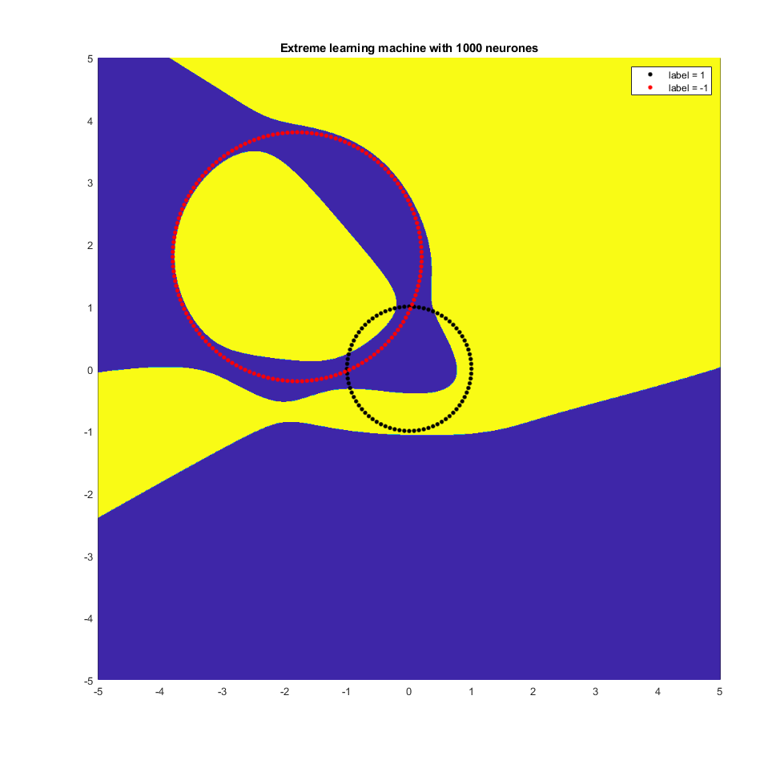
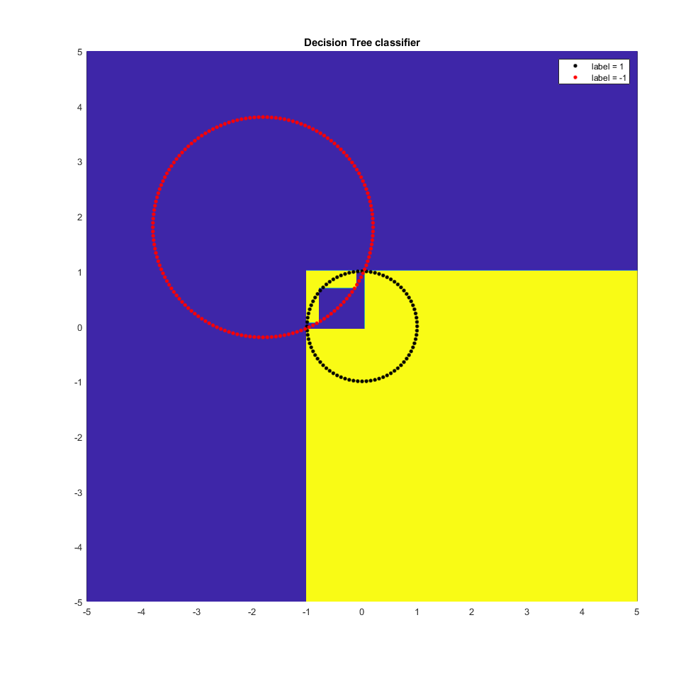
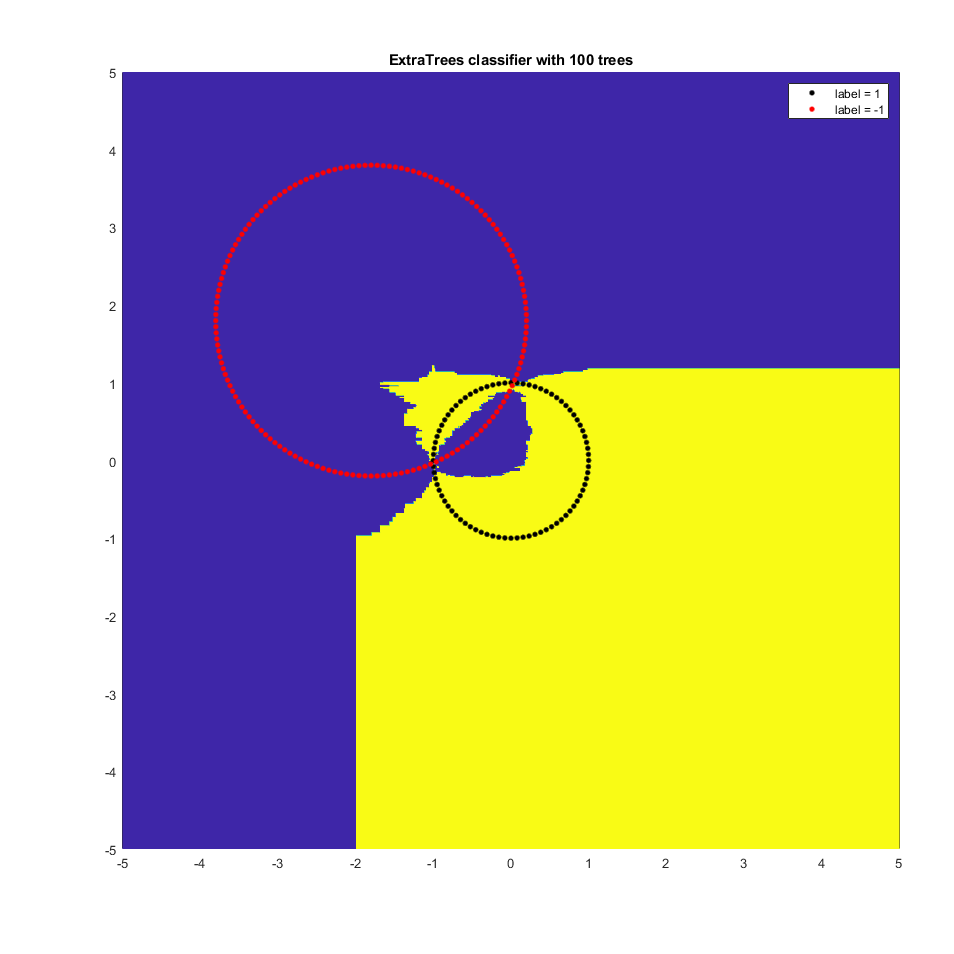
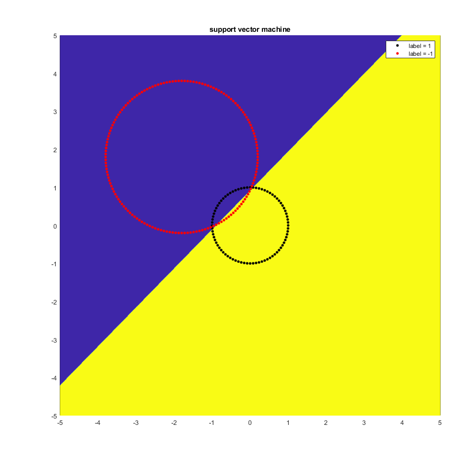

# homemade-machine-learning

These are some famous ML models which coding by myself with matlab.

# Adaboost with Logistic Regression

# Adaboost with ELM

# Adaboost with RBFNN

# ELM Classifier

# Decision Tree

# Extra Trees

# Bayes Classifier with Gaussian Mixed Model (5 Gaussian distributions)

.png)

# Bayes Classifier with Gaussian Mixed Model (15 Gaussian distributions)

.png)

# Support Vector Machine

